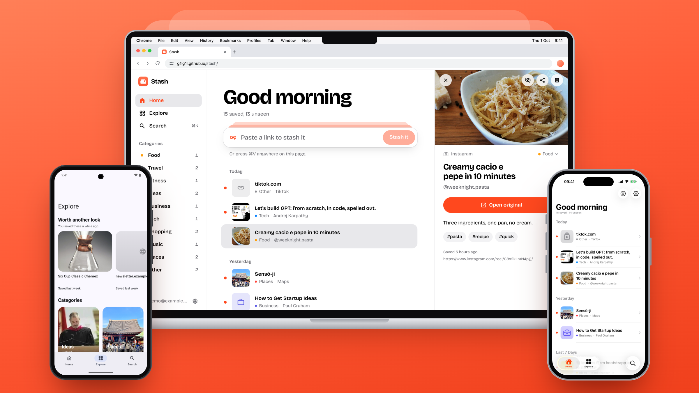

  

<h1 align="center">Stash</h1>

<b>Share it now. Find it later.</b>

<a href="https://g1lg1l.github.io/stash/"><b>Open Stash on the web</b></a> · <a href="https://github.com/g1lg1l/stash/releases/latest/download/stash.apk"><b>Download for Android</b></a>

  

That recipe on Instagram, the trail on YouTube, the café a friend sent you on Maps. Share it to Stash and move on. Stash grabs the title and picture, files it by topic, and brings it back when you've forgotten about it.

No account, works offline, and your saves stay on your phone. Sign in only if you want them on your other devices and the web.

## Get it

- **[Android](apps/android)**: [download the APK](https://github.com/g1lg1l/stash/releases/latest/download/stash.apk) from the [latest release](https://github.com/g1lg1l/stash/releases/latest). Android 12+.
- **[iPhone](apps/ios)**: no release yet (the App Store and TestFlight need the paid Apple Developer Program). [Build it from this repo](apps/ios#install) with Xcode on a Mac. iOS 26+.
- **[Web](apps/web)**: at [g1lg1l.github.io/stash](https://g1lg1l.github.io/stash/), with the same account as the apps.

All three do the same things; [REQUIREMENTS.md](REQUIREMENTS.md) is the list. Each one's page has screenshots and explains how to install it.

## License

[GPL-3.0](LICENSE)
