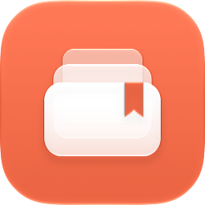
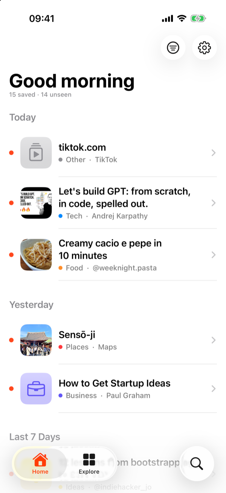
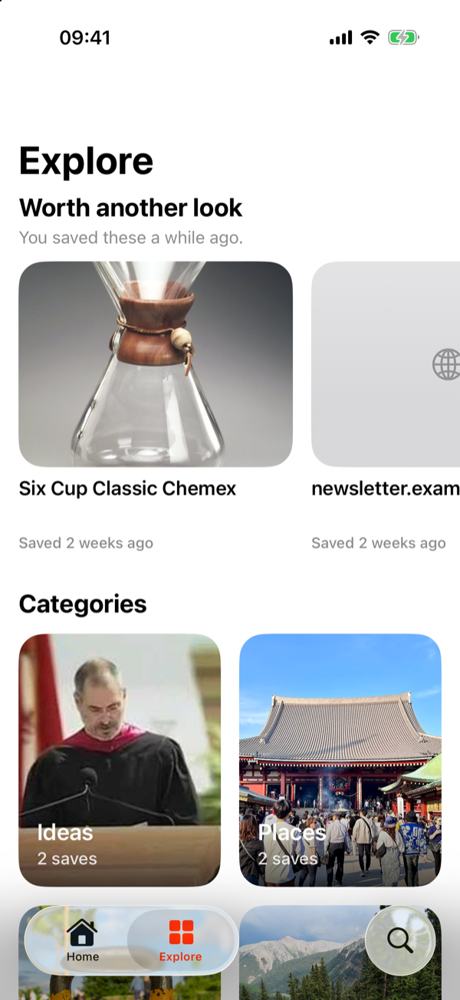
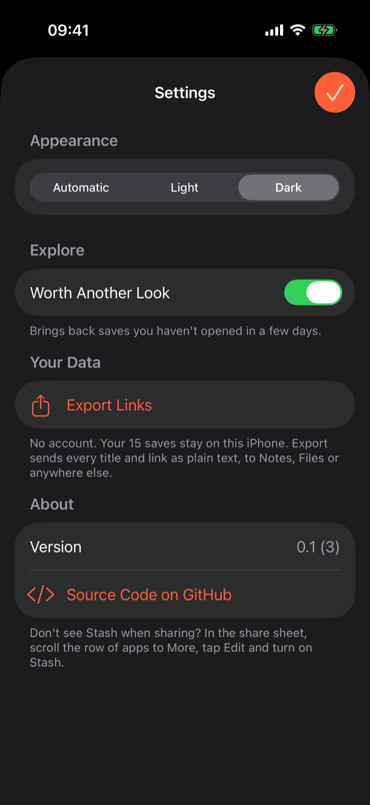

  

<h1 align="center">Stash</h1>

<b>Share it now. Find it later.</b>

  
  
  
  

That recipe on Instagram, the trail on YouTube, the café a friend sent you on Maps. Share it to Stash and move on. Stash grabs the title and picture, files it by topic, and brings it back when you've forgotten about it.

No account, works offline, and your saves stay on your iPhone.

## What it does

- **One tap from any app:** Safari, YouTube, Instagram, TikTok, Reddit, X, Spotify, Maps…
- **Sorts itself:** titles, pictures and categories are filled in for you. Change a category and it sticks.
- **Brings things back:** "Worth another look" resurfaces what you saved and never opened.
- **Finds anything:** instant search across everything you've saved.
- Cards or a list, light or dark, and your links export in one tap.

## Install

You need a Mac with Xcode 27+, an iPhone on iOS 26+, and an Apple ID (a free one works).

1. Connect the iPhone and tap **Trust**. If iOS asks, turn on *Settings → Privacy & Security → Developer Mode*.
2. Open `Stash.xcodeproj`, sign in under *Xcode → Settings → Accounts*, and pick your team in *Signing & Capabilities* for all three targets. If you cloned this repo, use your own bundle IDs and App Group.
3. Choose your iPhone and press **⌘R**. Do the first run from Xcode, not the command line: that's what lets the share sheet reach the app.
4. On the phone, trust the developer: *Settings → General → VPN & Device Management*.

With a free Apple ID the app expires after 7 days. Run it from Xcode again and your saves are still there.

Just want a look? Pick a simulator and press **⌘R**. It opens with sample saves.

## Put Stash first in the share sheet

iOS hides new share options, so move Stash to where your thumb already is:

- **Favorite app:** in any share sheet, scroll the row of apps to the end and tap **More**. Tap **Edit**, tap the green **+** next to Stash and drag it to the top.
- **Favorite action:** scroll to the bottom of the share sheet and tap **Edit Actions…**. Add **Save to Stash** to Favorites and drag it to the top.

Now it's the first thing you see whenever you share.

## License

[GPL-3.0](LICENSE)
