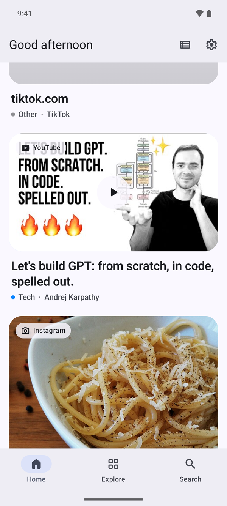

  

<h1 align="center">Stash</h1>

<b>Share it now. Find it later.</b>

  
  

That recipe on Instagram, the trail on YouTube, the café a friend sent you on Maps. Share it to Stash and move on. Stash grabs the title and picture, files it by topic, and brings it back when you've forgotten about it.

No account, works offline, and your saves stay on your phone.

## Get it

- **[iPhone](apps/ios)**: Swift and SwiftUI, iOS 26+.
- **[Android](apps/android)**: Kotlin and Jetpack Compose, Android 12+.
- **Web**: coming.

Both apps do the same things; [REQUIREMENTS.md](REQUIREMENTS.md) is the list. Each app's page explains how to install it.

## License

[GPL-3.0](LICENSE)
