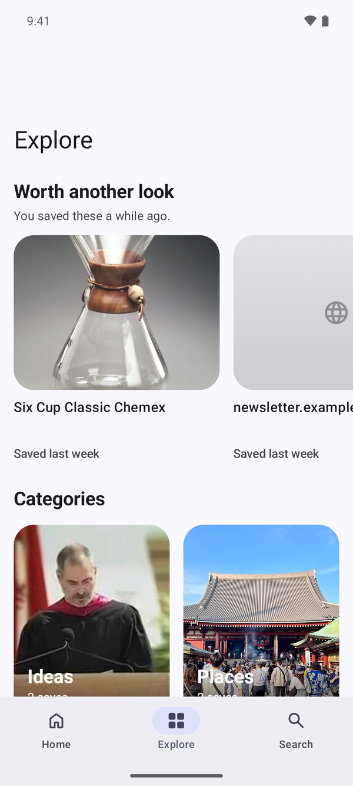
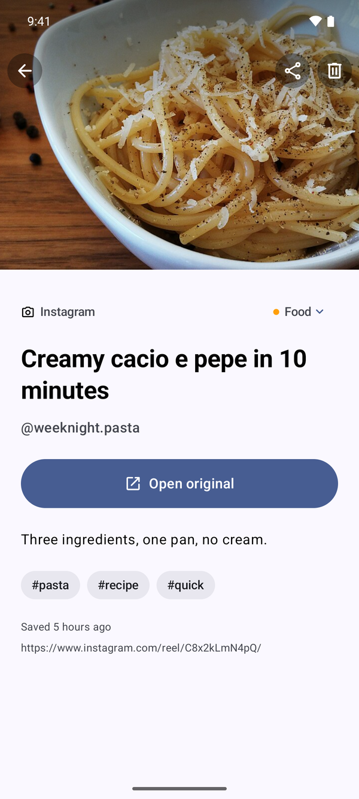
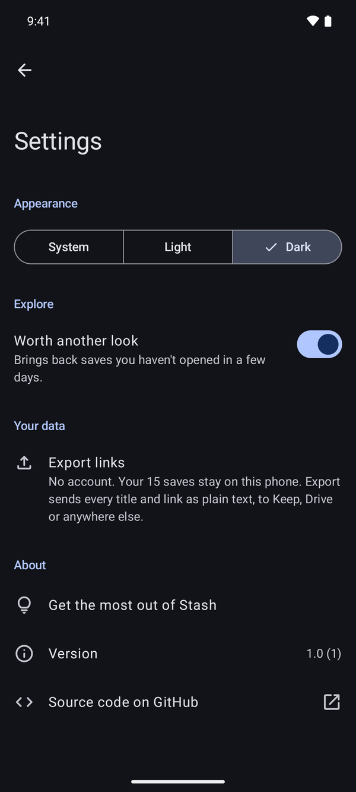
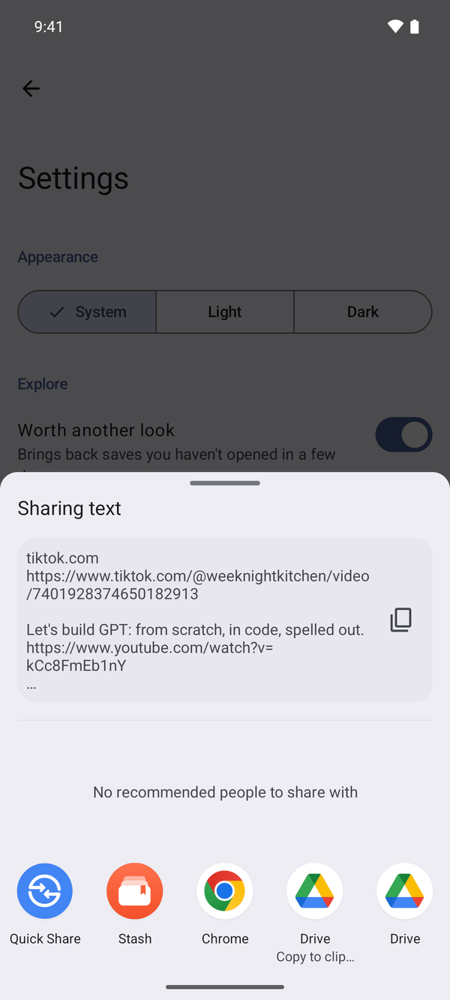
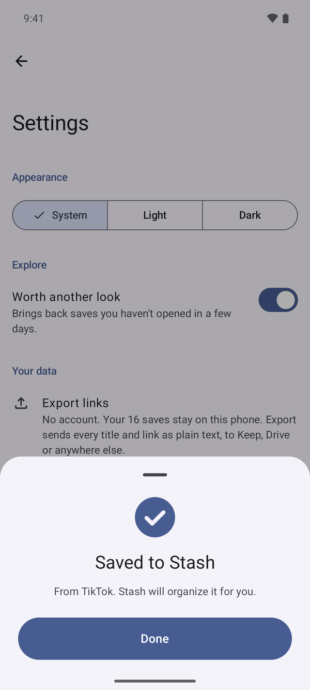
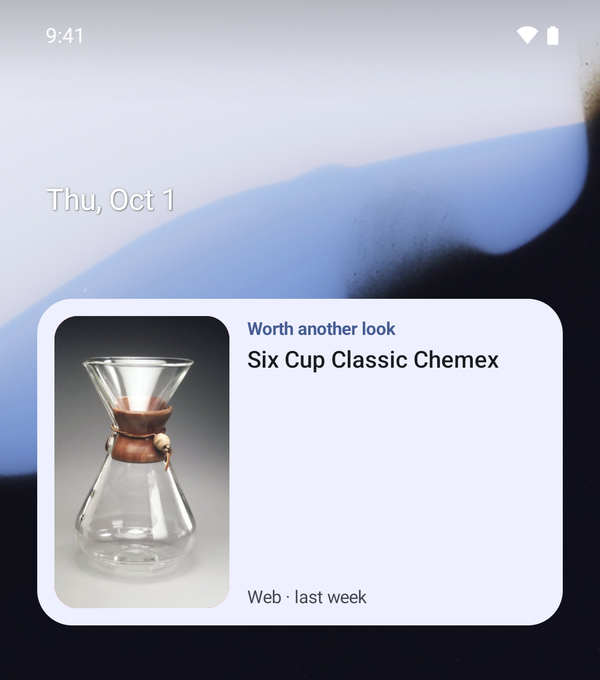

<p align="center">
  
</p>

<h1 align="center">Stash for Android</h1>

<p align="center"><b>Share it now. Find it later.</b></p>

<p align="center">
  
  
  
  
</p>

That recipe on Instagram, the trail on YouTube, the café a friend sent you on Maps. Share it to Stash and move on. Stash grabs the title and picture, files it by topic, and brings it back when you've forgotten about it.

No account, works offline, and your saves stay on your phone. Colors follow your wallpaper.

There's also an [iPhone app](../ios). Both do the same things; [REQUIREMENTS.md](../../REQUIREMENTS.md) is the list.

## What it does

- **One tap from any app:** YouTube, Instagram, TikTok, Reddit, X, Spotify, Maps, Chrome… Share to Stash, or select a link anywhere and tap **Save to Stash**.
- **Sorts itself:** titles, pictures and categories are filled in for you. Change a category and it sticks.
- **Brings things back:** "Worth another look" resurfaces what you saved and never opened.
- **Finds anything:** instant search across everything you've saved.
- **On your Home screen:** a widget shows one thing you saved. Tap it to open.
- Cards or a list, light or dark, swipe to mark as seen or delete (with Undo), and your links export in one tap.

## Install

You need an Android phone on Android 12 or later, a USB cable, and a Mac, Windows or Linux computer with [Android Studio](https://developer.android.com/studio).

1. On the phone, turn on developer options: *Settings → About phone*, tap **Build number** seven times. Then turn on *Settings → System → Developer options → USB debugging*.
2. Connect the phone and allow USB debugging when it asks.
3. Open this folder in Android Studio, pick your phone at the top and press **Run**.

From a terminal instead, `./gradlew installRelease` installs the fast, optimized build. It's signed with your computer's debug key, which is fine for your own phone. Your saves stay when you install a newer build.

Just want a look? Start an emulator in Android Studio, run the app, then open it with sample saves:

```sh
adb shell am start -n com.g1lg1l.stash/.MainActivity --ez sampleData true
```

## Make it one tap

<p align="center">
  
  
  
</p>

- **Pin Stash in the share sheet:** share anything, then touch and hold **Stash** in the list of apps and tap **Pin**. It stays first from then on.
- **Save any link you select:** select a link in any app, open the menu next to **Copy** and tap **Save to Stash**.
- **Widget:** touch and hold the Home screen, tap **Widgets** and find Stash.

The same steps are in the app, under *Settings → Get the most out of Stash*.

## License

[GPL-3.0](../../LICENSE)
