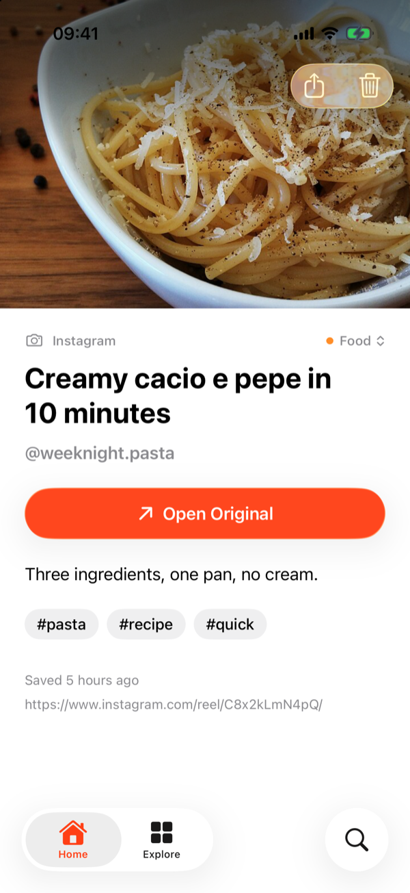
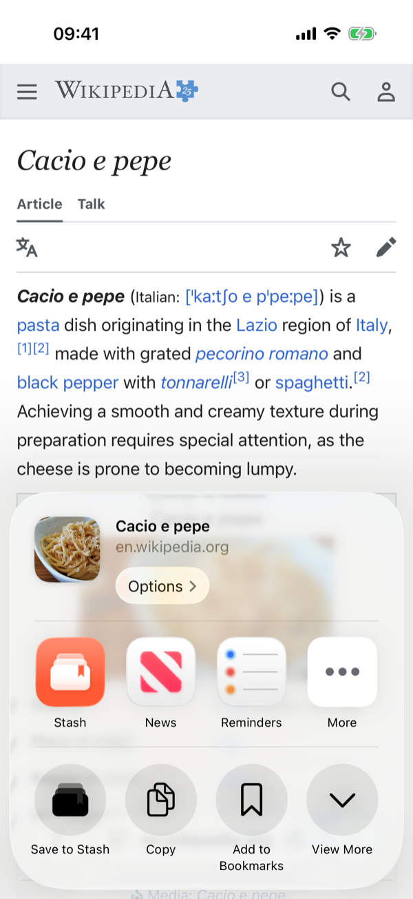
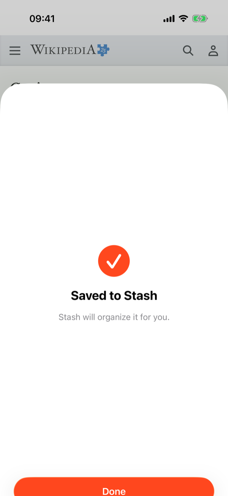
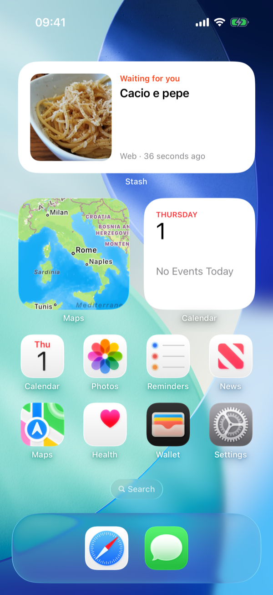

  

<h1 align="center">Stash for iPhone</h1>

<b>Share it now. Find it later.</b>

  
  
  
  

That recipe on Instagram, the trail on YouTube, the café a friend sent you on Maps. Share it to Stash and move on. Stash grabs the title and picture, files it by topic, and brings it back when you've forgotten about it.

Works offline and without an account, and your saves stay on your iPhone. Sign in only if you want them synced.

There's also an [Android app](../android). Both do the same things; [REQUIREMENTS.md](../../REQUIREMENTS.md) is the list.

## What it does

- **One tap from any app:** Safari, YouTube, Instagram, TikTok, Reddit, X, Spotify, Maps…
- **Sorts itself:** titles, pictures and categories are filled in for you. Change a category and it sticks.
- **Brings things back:** "Worth another look" resurfaces what you saved and never opened.
- **Finds anything:** instant search across everything you've saved.
- **On your Home Screen:** a widget shows one thing you saved. Tap it to open.
- Cards or a list, light or dark, and your links export in one tap.

## Account and sync (optional)

Stash never asks for an account. If you want your saves on more than one device, sign in or create one with an email and password, on the welcome screen or in *Settings → Account*. Your iPhone keeps its own copy: it syncs when you open or leave the app, on pull to refresh and on **Sync Now**, and keeps working offline.

**Sign Out** keeps every save on the iPhone. **Delete Account** removes the account and the copy on the server, and also keeps your saves on the iPhone.

## Install

There's no iPhone release yet: no App Store or TestFlight build, since both need the paid Apple Developer Program. Build it from this repo on your Mac instead.

You need a Mac with Xcode 27+, an iPhone on iOS 26+, and an Apple ID (a free one works).

1. Connect the iPhone and tap **Trust**. If iOS asks, turn on *Settings → Privacy & Security → Developer Mode*.
2. Open `Stash.xcodeproj`, sign in under *Xcode → Settings → Accounts*, and pick your team in *Signing & Capabilities* for every target. If you cloned this repo, use your own bundle IDs and App Group.
3. Choose your iPhone and press **⌘R**. Do the first run from Xcode, not the command line: that's what lets the share sheet reach the app.
4. On the phone, trust the developer: *Settings → General → VPN & Device Management*.

With a free Apple ID the app expires after 7 days. Run it from Xcode again and your saves are still there.

Just want a look? Pick a simulator and press **⌘R**. It opens with sample saves.

## Make it one tap

  
  
  

iOS hides new share options, so move Stash to where your thumb already is:

- **Favorite app:** in any share sheet, scroll the row of apps to the end and tap **More**. Tap **Edit**, tap the green **+** next to Stash and drag it to the top.
- **Favorite action:** in the share sheet, tap **View More**, then **Edit Actions** at the bottom. Add **Save to Stash** to Favorites and drag it to the top.
- **Widget:** touch and hold the Home Screen, tap **Edit → Add Widget** and search for Stash.

The same steps are in the app, under *Settings → Get the Most Out of Stash*.

## License

[GPL-3.0](../../LICENSE)
