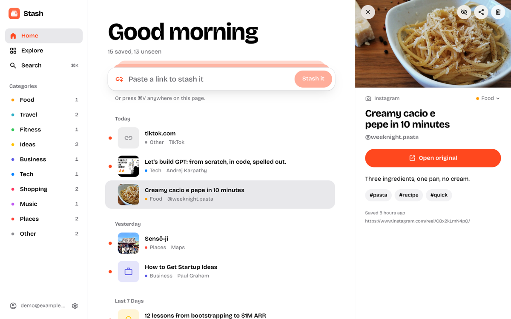
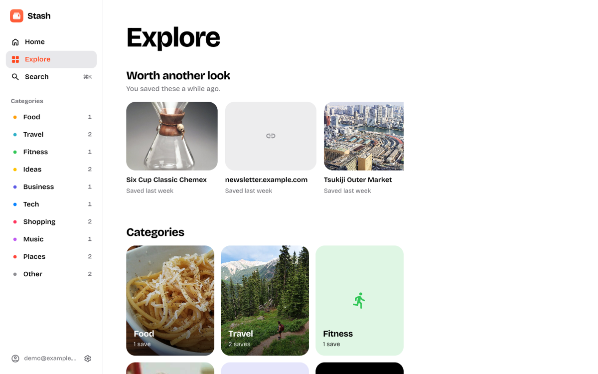
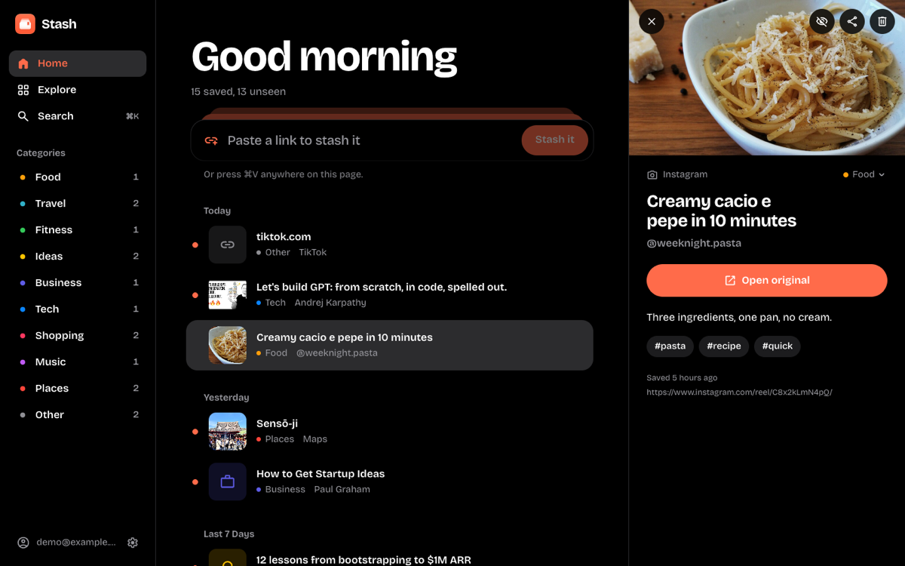
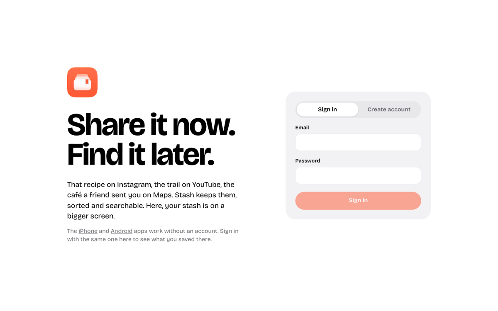

<p align="center">
  
</p>

<h1 align="center">Stash on the web</h1>

<p align="center"><b>Share it now. Find it later.</b></p>

<p align="center">
  
  
</p>
<p align="center">
  
  
</p>

Your stash on a bigger screen, at **[g1lg1l.github.io/stash](https://g1lg1l.github.io/stash/)**. Sign in with the account from the [iPhone](../ios) or [Android](../android) app and everything you saved there is here, sorted by day, by category, and searchable.

- **Paste to save:** paste a link in the bar at the top, or press ⌘V (Ctrl+V) anywhere on the page. Text with a link in it works too.
- **Same as the apps:** Worth another look, categories, search across titles, notes, tags and links, mark as seen, change a category, delete with Undo.
- **Light or dark,** following your system or your choice in Settings.

The web needs an account: it keeps nothing in the browser but your session. Links saved here get their title and picture once one of your phones syncs.

## Run it

You need [Node.js](https://nodejs.org) 22 or later.

```sh
npm install
npm run dev     # http://localhost:5173/stash/
npm test
```

## License

[GPL-3.0](../../LICENSE)
